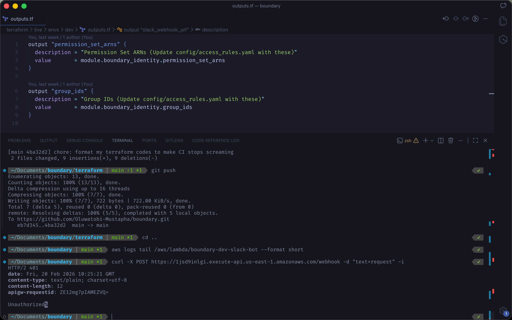

# Threat Model

**Last Updated:** 2026-02-20  
**Scope:** Core Policy Engine, AWS Adapters, State Management, and ChatOps Boundary

---

## 1. Trust Boundaries

### Boundary A — User / Input

- The interface (Slack / CLI) submitting an AccessRequest
- The Identity Provider (Slack Auth) is trusted
- The request payload (duration, account ID) is treated as **untrusted input**

### Boundary B — Infrastructure

- The connection between the Engine and AWS APIs
- AWS Control Plane is assumed secure
- Network reliability, API availability, and data consistency are considered fallible

### Boundary C — Configuration

- The `access_rules.yaml` file on disk
- Treated as the **root of trust** for all access decisions

### Boundary D — Public Internet / Webhook Edge

- The API Gateway endpoint exposed to the public internet
- All incoming HTTP traffic is treated as **hostile until cryptographically verified**

---

## 2. Identified Threats & Mitigations

### A. Spoofing & Replay Attacks (Impersonation)

#### Threat A-1: Forged HTTP Requests

**Description:** A malicious actor discovers the public API Gateway URL and sends forged HTTP POST requests to grant unauthorized AWS access.

**Mitigation:**

- **Application-Layer Cryptography:** Lambda executes HMAC-SHA256 validation using the Slack Signing Secret
- Requests lacking valid `x-slack-signature` are rejected with `401 Unauthorized`

Image: 

**Compliance Alignment:**

- ISO 27001:2022 A.9.4.2 (Secure log-on procedures)
- NIST 800-53 IA-2 (Identification and Authentication)

#### Threat A-2: Replay Attacks

**Description:** An attacker intercepts a valid Slack payload and resends it later to re-grant access.

**Mitigation:**

- **Temporal Validation:** Lambda extracts `x-slack-request-timestamp` and rejects requests older than 5 minutes

**Compliance Alignment:**

- ISO 27001:2022 A.9.4.3 (Password management system)
- NIST 800-53 IA-8 (Identification and Authentication for Non-Organizational Users)

#### Threat A-3: Internal Spoofing

**Description:** A user requests access to an unauthorized account by supplying incorrect OU ID.

**Mitigation:**

- **Contextual Validation:** Engine fetches authoritative OU path via `AWSOrganizationsAdapter`
- **Principal Mapping:** Uses immutable Identity Store IDs (`principal_id`) instead of mutable usernames

**Compliance Alignment:**

- SOC 2 CC6.1 (Logical and Physical Access Controls)
- ISO 27001:2022 A.9.2.1 (User registration and de-registration)

#### Threat A-4: Identity Mismatch

**Description:** Compromised Slack account or misconfigured workspace leads to wrong AWS user being provisioned.

**Mitigation:**

- **Strict UPN Mapping:** Policy Engine queries Slack `users.info` API using securely vaulted Bot Token
- AWS Identity Center strictly matches email against immutable Identity Store

**Compliance Alignment:**

- NIST 800-53 IA-4 (Identifier Management)
- ISO 27001:2022 A.9.2.4 (Management of secret authentication information)

---

### B. Tampering (Integrity)

#### Threat B-1: Policy File Manipulation

**Description:** Rogue administrator modifies `access_rules.yaml` to allow unauthorized access, then reverts to conceal activity.

**Mitigation:**

- **Cryptographic Binding:** Engine computes `SHA256(access_rules.yaml)` at startup
- **Immutable Evidence:** `policy_hash` embedded in every JSON audit log and database record
- Mismatches between logs and Git history are detectable

**Compliance Alignment:**

- ISO 27001:2022 A.12.4.1 (Event logging)
- NIST 800-53 AU-9 (Protection of Audit Information)
- SOC 2 CC7.2 (System Monitoring)

---

### C. Repudiation (Denial of Action)

#### Threat C-1: User Denies Access Request

**Description:** User claims they did not request access or system granted access erroneously.

**Mitigation:**

- **Durable Artifacts:** Every evaluation produces timestamped JSON artifact in `audit_logs/`
- **Dual-Identifier Logging:** Logs both human-readable names (e.g., `ReadOnly`) and immutable identifiers (e.g., ARNs)
- Prevents ambiguity if names are reused

**Compliance Alignment:**

- ISO 27001:2022 A.12.4.3 (Administrator and operator logs)
- NIST 800-53 AU-10 (Non-Repudiation)
- SOC 2 CC6.8 (Audit Logging)

---

### D. Information Disclosure

#### Threat D-1: Log/UI Leakage

**Description:** Sensitive data (credentials, stack traces) leaked through logs or UI output.

**Mitigation:**

- **Controlled UI Rendering:** Output strictly formatted via `printer.py`
- **Fail-Closed Error Handling:** Infrastructure errors return generic `Infrastructure Error` status
- Raw Python stack traces are not exposed

**Compliance Alignment:**

- ISO 27001:2022 A.8.2.3 (Handling of assets)
- NIST 800-53 SI-11 (Error Handling)

#### Threat D-2: IaC Secret Leakage

**Description:** Third-party API keys (Slack OAuth Tokens, Signing Secrets) exposed in plaintext inside `terraform.tfstate` S3 bucket.

**Mitigation:**

- **Out-of-Band Bootstrapping:** Secrets manually injected into AWS SSM Parameter Store as `SecureString` types
- Terraform strictly limited to managing IAM permissions to read parameters
- Decouples secret material from infrastructure code

**Compliance Alignment:**

- ISO 27001:2022 A.9.4.5 (Use of privileged utility programs)
- NIST 800-53 SC-28 (Protection of Information at Rest)
- SOC 2 CC6.7 (Encryption)

---

### E. Denial of Service (Availability)

#### Threat E-1: AWS API Outages

**Description:** AWS API throttling or outages cause system crash or hang, leaving access grants inconsistent.

**Mitigation:**

- **Caching:** Permission Set name lookups and Slack SSM parameters cached to reduce API calls
- **Pagination Support:** Tag retrieval supports pagination to prevent memory exhaustion
- **Fail-Closed Logic:** If AWS unreachable, workflow catches exception, denies request, system remains stable

**Compliance Alignment:**

- ISO 27001:2022 A.17.2.1 (Availability of information processing facilities)
- NIST 800-53 SC-5 (Denial of Service Protection)

#### Threat E-2: Third-Party Rate Limiting

**Description:** System triggers Slack API rate limits (HTTP 429) during burst of access requests, causing Identity Mapper to drop requests.

**Mitigation:**

- **Resilient API Client:** Slack Adapter implements automatic exponential backoff, retries, and caching for `user_id -> email` resolution

**Compliance Alignment:**

- ISO 27001:2022 A.17.1.1 (Planning information security continuity)
- NIST 800-53 SI-13 (Predictable Failure Prevention)

#### Threat E-3: Memory Exhaustion via Unbounded Cache

**Description:** Long-running Lambda functions accumulate unlimited cache entries (Slack user mappings, AWS Identity Store lookups), eventually exhausting memory and causing OOM crashes.

**Mitigation:**

- **Bounded LRU Cache:** Both SlackAdapter and IdentityStoreAdapter enforce max 1000 entries using OrderedDict
- Oldest entries evicted automatically when limit reached
- Cache size validated at initialization (must be > 0)

**Compliance Alignment:**

- ISO 27001:2022 A.12.1.3 (Capacity management)
- NIST 800-53 SC-5 (Denial of Service Protection)
- SOC 2 CC7.2 (System Monitoring)

---

### F. Privilege Escalation

#### Threat F-1: Cache Poisoning Attack

**Description:** Attacker exploits race condition or API manipulation to inject false identity mappings into adapter caches (e.g., map attacker's Slack ID to victim's AWS Principal ID).

**Mitigation:**

- **Authoritative Source Validation:** All cache entries sourced directly from Slack Web API and AWS Identity Store API
- **HTTPS-Only Communication:** All API calls use TLS 1.2+ with certificate validation
- **Input Validation:** Slack user IDs validated against format `^U[A-Z0-9]{10}$`, emails validated via regex
- **Short TTL:** Cache entries expire after 5 minutes, limiting exposure window

**Compliance Alignment:**

- ISO 27001:2022 A.14.1.2 (Securing application services on public networks)
- NIST 800-53 SC-8 (Transmission Confidentiality and Integrity)
- SOC 2 CC6.1 (Logical and Physical Access Controls)

---

### G. Privacy & Data Protection

#### Threat G-1: PII Leakage in Application Logs

**Description:** User emails and AWS Principal IDs logged at INFO/WARNING levels, exposing PII in CloudWatch Logs accessible to operations teams.

**Mitigation:**

- **DEBUG-Level PII Logging:** All emails and user IDs logged exclusively at DEBUG level
- Production Lambda functions run at INFO level by default (DEBUG disabled)
- Generic error messages sent to users ("Unable to map your identity") without exposing internal details

**Compliance Alignment:**

- ISO 27001:2022 A.18.1.4 (Privacy and protection of personally identifiable information)
- NIST 800-53 SI-11 (Error Handling)
- SOC 2 CC6.7 (Confidentiality)
- GDPR Article 32 (Security of Processing)

---

## 3. Residual Risks (Accepted / To Be Addressed)

### Risk R-1: DynamoDB / Storage Failures

**Current State:** Audit logs written to JSON files; disk exhaustion could result in log loss.

**Future Mitigation:** Offload audit artifacts to S3 or DynamoDB.

**Compliance Impact:** May affect ISO 27001:2022 A.12.4.2 (Protection of log information)

### Risk R-2: Race Conditions

**Current State:** User removed from group during evaluation may still receive access within sub-second window.

**Accepted Risk:** AWS IAM propagation delays exceed this window; considered acceptable given platform constraints.

**Compliance Impact:** Minimal; aligns with NIST 800-53 AC-2(4) (Automated Audit Actions)

---

## 4. Compliance Summary

This threat model addresses requirements from:

- **ISO 27001:2022** — Information Security Management (Annex A controls)
- **NIST 800-53 Rev 5** — Security and Privacy Controls for Information Systems
- **SOC 2 Type II** — Trust Services Criteria (Security, Availability, Confidentiality)
- **AWS Well-Architected Framework** — Security Pillar (Identity and Access Management)

All mitigations are designed to support audit readiness for enterprise security certifications.
